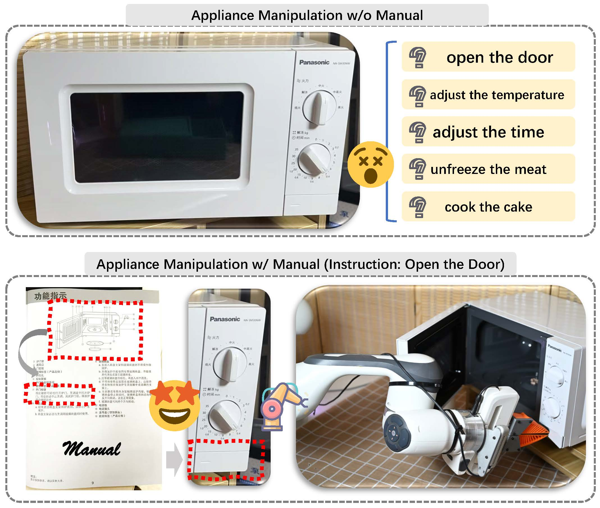

# CheckManual: A New Challenge and Benchmark for Manual-based Appliance Manipulation

we propose the first manual-based appliance manipulation benchmark **CheckManual**. Specifically, we design a large model-assisted human-revised data generation pipeline to create manuals based on CAD appliance models. With these manuals, we establish novel manual-based manipulation challenges, metrics, and simulator environments for model performance evaluation. Furthermore, we propose the first manual-based manipulation planning model **ManualPlan** to set up a group of baselines for the  **CheckManual** benchmark.

<p align="center">
  
</p>


## 🔥 News
- 2025.04.04: Our paper is announced as CVPR 2025 Highlight.
- 2025.02.26: Our paper [**CheckManual: A New Challenge and Benchmark for Manual-based Appliance Manipulation**](https://github.com/LYX0501/CheckManual/blob/main/paper/CVPR2025_CheckManual.pdf) is accepted by CVPR 2025. 

## 🌏 Environment

### Data Preparation
Please download the PartNet-Mobility dataset from https://sapien.ucsd.edu/downloads and the CheckManual dataset from ...... Then, you should rearrange them in the **data** file as the following format.

```
|data
| -- sapien_dataset
|    | -- 148
|    | -- 149
|    | -- 152
|    `-- ...
| -- checkmanual_dataset
|    | -- manual_1
|    | -- manual_2
|    | -- manual_3
|    `-- ...
```

### Install SAPIEN Simulator
First, install SAPIEN (Python 3.6) following
```
pip install http://download.cs.stanford.edu/orion/where2act/where2act_sapien_wheels/sapien-0.8.0.dev0-cp36-cp36m-manylinux2014_x86_64.whl
```
For other Python versions, you can use one of the following
```
pip install http://download.cs.stanford.edu/orion/where2act/where2act_sapien_wheels/sapien-0.8.0.dev0-cp35-cp35m-manylinux2014_x86_64.whl
pip install http://download.cs.stanford.edu/orion/where2act/where2act_sapien_wheels/sapien-0.8.0.dev0-cp37-cp37m-manylinux2014_x86_64.whl
pip install http://download.cs.stanford.edu/orion/where2act/where2act_sapien_wheels/sapien-0.8.0.dev0-cp38-cp38-manylinux2014_x86_64.whl
```
Please do not use the default `pip install sapien` as SAPIEN is being actively updated.

## ✒ Citation
Please cite our paper if you find it helpful :)
```
@article{checkmanual,
    author    = {Long, Yuxing and Zhang, Jiyao and Pan, Mingjie and Wu, Tianshu and Kim, Taewhan and Dong, Hao},
    title     = {CheckManual: A New Challenge and Benchmark for Manual-based Appliance Manipulation},
    booktitle = {Proceedings of the IEEE/CVF Conference on Computer Vision and Pattern Recognition (CVPR)},
    month     = {June},
    year      = {2025},
}
```
