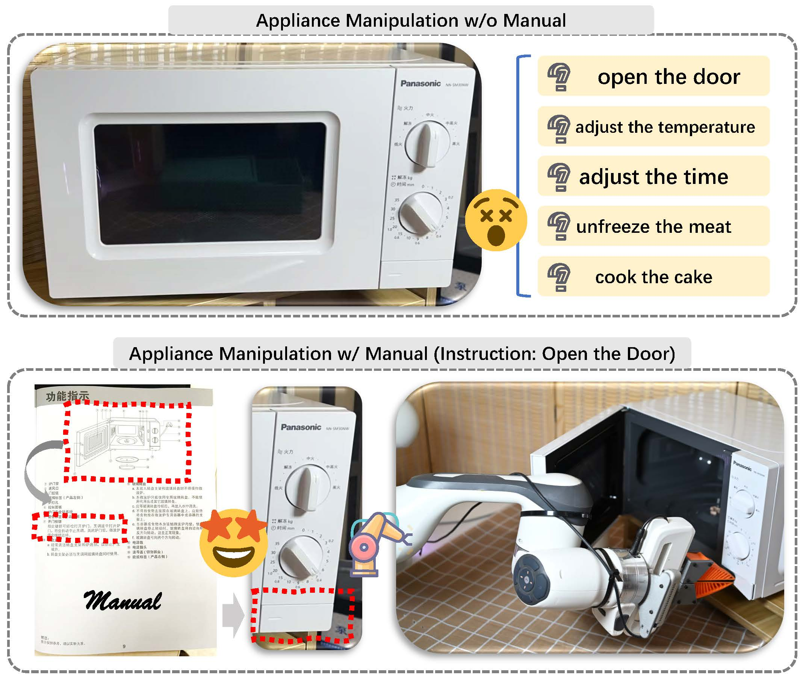

<div align="center">

# CheckManual

### A New Challenge and Benchmark for Manual-based Appliance Manipulation

[](docs/paper/CVPR2025_CheckManual.pdf)
[](https://drive.google.com/file/d/1YasM5Se7h4H8wCqZFN3mK8sCu1cEZBo7/view?usp=drive_link)
[](#installation)
[](#installation)

Manual understanding, visual grounding, and embodied appliance manipulation in one reproducible benchmark.



</div>

## Overview

CheckManual evaluates whether an agent can read appliance manuals, identify the
corresponding functional parts, and execute manipulation tasks in simulation.
This repository contains the evaluation code and ManualPlan baselines; datasets
and model checkpoints are downloaded separately.

| Track | Goal | Main entry |
| --- | --- | --- |
| Track 1 | Manual-based part-function alignment and task planning | `track1_ManualPlan.py` |
| Track 2 | Primitive-action manipulation with visual alignment | `track2_ManualPlan_fast.py` |
| Track 3 | Long-horizon planning, grounding, and execution | `track3_ManualPlan_fast.py` |

## News

- 2025.06.09: ManualPlan framework and Track 1 evaluation scripts released.
- 2025.06.05: [CheckManual dataset](https://drive.google.com/file/d/1YasM5Se7h4H8wCqZFN3mK8sCu1cEZBo7/view?usp=drive_link) released.
- 2025.04.04: CheckManual was selected as a CVPR 2025 Highlight.
- 2025.02.26: CheckManual was accepted by CVPR 2025.

## Installation

The code was tested with Python 3.8, CUDA-capable GPUs, Ubuntu 20.04, and
SAPIEN 0.8.0.

```bash
git clone https://github.com/LYX0501/CheckManual.git
cd CheckManual

conda create -n checkmanual python=3.8
conda activate checkmanual

pip install torch==1.13.1+cu117 torchvision==0.14.1+cu117 \
  torchaudio==0.13.1 --extra-index-url https://download.pytorch.org/whl/cu117

sudo apt-get update
sudo apt-get install -y poppler-utils xvfb

pip install \
  http://download.cs.stanford.edu/orion/where2act/where2act_sapien_wheels/sapien-0.8.0.dev0-cp38-cp38-manylinux2014_x86_64.whl

pip install -r requirements.txt
```

Do not use the latest `pip install sapien`; these scripts expect the older
SAPIEN 0.8.0 API. Install optional perception dependencies only when running
predicted visual grounding or the local SAM/GroundingDINO server:

```bash
pip install -r requirements-perception.txt
```

## Data Preparation

Download the [CheckManual dataset](https://drive.google.com/file/d/1YasM5Se7h4H8wCqZFN3mK8sCu1cEZBo7/view?usp=drive_link)
and the corresponding [PartNet-Mobility/SAPIEN assets](https://sapien.ucsd.edu/downloads),
then arrange them as follows:

```text
data/
├── CheckManual_Data/
│   ├── manual_1/
│   │   ├── 100279_printer_manual_group1.pdf
│   │   ├── eval_tasks.json
│   │   └── part_state_functions.json
│   └── ...
└── sapien_dataset/
    ├── 100279/
    │   ├── mobility.urdf
    │   ├── semantics.txt
    │   ├── mobility_v2.json
    │   ├── meta.json
    │   └── textured_objs/
    └── ...
```

The public release contains 1107 manual samples, 1484 manipulation tasks, 182
unique CAD shape ids, and 10 appliance categories. Dataset folders, checkpoints,
generated caches, and `results/` are intentionally ignored by Git.

## API Configuration

ManualPlan uses GPT/GPT-V for planning and multimodal alignment:

```bash
export CHECKMANUAL_GPT_KEY="Bearer sk-..."
export CHECKMANUAL_GPT_URL="https://your-api-host/v1"
export CHECKMANUAL_GPT_MODEL="gpt-4o"
```

OCR is optional. If Baidu OCR is not configured, scripts fall back to local
`pdftotext`.

```bash
export CHECKMANUAL_OCR_API_KEY="..."
export CHECKMANUAL_OCR_SECRET_KEY="..."
```

You can also fill `api_utils/api_key_config.json`; do not commit real keys.

## Evaluation

### Track 1: Manual Planning

```bash
python track1_ManualPlan.py \
  --manual_data_path data/CheckManual_Data \
  --data_dir data/sapien_dataset \
  --out_dir results/track1_full
```

### Track 2: Primitive Manipulation

Track 2 evaluates primitive-action manipulation. Start FoundationPose first,
then run the full evaluation:

```bash
python perception/FoundationPose_Server/foundationpose_flask.py

python track2_ManualPlan_fast.py \
  --manual_dir data/CheckManual_Data \
  --data_dir data/sapien_dataset \
  --foundationpose_url http://127.0.0.1:6006/foundationpose_flask \
  --grasp_server_url http://127.0.0.1:5000/grasp \
  --out_dir results/track2_full
```

FoundationPose setup details are available in
`perception/FoundationPose_Server/README.md`.

### Track 3: Long-horizon Manipulation

Run planning-only evaluation:

```bash
python track3_ManualPlan_fast.py \
  --manual_dir data/CheckManual_Data \
  --data_dir data/sapien_dataset \
  --out_dir results/track3_full_plan
```

Run planning plus execution:

```bash
python track3_ManualPlan_fast.py \
  --manual_dir data/CheckManual_Data \
  --data_dir data/sapien_dataset \
  --execute \
  --out_dir results/track3_full_execute
```

The default execution path uses stable joint-level fallbacks for button and knob
actions. Physical button/knob interaction and non-fallback visual grounding
require the SAM/GroundingDINO server:

```bash
export CHECKMANUAL_GROUNDING_DINO_CONFIG=/path/to/GroundingDINO_SwinT_OGC.py
export CHECKMANUAL_GROUNDING_DINO_CHECKPOINT=/path/to/groundingdino_swint_ogc.pth
export CHECKMANUAL_SAM_CHECKPOINT=/path/to/sam_vit_h_4b8939.pth
export CHECKMANUAL_CV_SERVER_PORT=5002

python perception/cv_server.py --port 5002
```

Then add `--try_physical_button_press` and/or `--try_physical_knob_rotate` when
needed. Track 3 execution isolates samples in subprocesses by default, so native
SAPIEN mesh failures are written as `sample_error` and the batch continues.

## Outputs

Each track writes JSON results, logs, and runtime caches under the chosen
`--out_dir`:

```text
results/track3_full_execute/
├── track3_results.json
├── track3.log
├── runtime_cache/
└── track3/
```

Generated files stay under `results/` so the released data directory remains
clean.

## Troubleshooting

- Activate `conda activate checkmanual` if imports fail in `base`.
- Start `python perception/cv_server.py --port 5002` if visual grounding reports
  `CV server request failed`.
- Keep Track 3 subprocess isolation enabled for large batch execution.
- Check `results/<run_name>/*.log` for sample-level errors and external service
  connection failures.

## Citation

If you find CheckManual useful, please cite:

```bibtex
@inproceedings{checkmanual,
    author    = {Long, Yuxing and Zhang, Jiyao and Pan, Mingjie and Wu, Tianshu and Kim, Taewhan and Dong, Hao},
    title     = {CheckManual: A New Challenge and Benchmark for Manual-based Appliance Manipulation},
    booktitle = {Proceedings of the IEEE/CVF Conference on Computer Vision and Pattern Recognition (CVPR)},
    month     = {June},
    year      = {2025},
}
```
